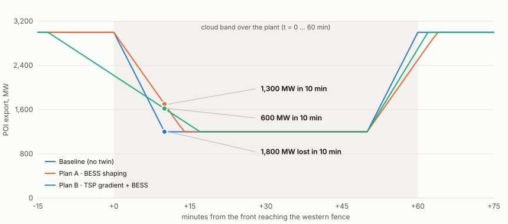

::: {.meta}
**Prepared for** Sarah Khashoggi and the NAJM-3000 team · **Inputs audited** the English *Comprehensive Reference Guide* (six modules, Smart Load Control), the Arabic *الدليل المرجعي النهائي* (three modules), the *OPUS Grilling* report of 9 September, the August deck, and the full texts of the Saudi Arabian Grid Code (May 2026), the Saudi Arabian Distribution Code (June 2026), SERA's Transmission Planning Criteria (2025) and Generation Expansion Planning Criteria (2021), the challenge card, the MDPI paper and the IEA report. Every clause number below was read in those texts, not from memory.
:::

# 0. Verdict in one page

**The concept survives. The documents do not — yet.** The idea of a grid-facing digital twin that forecasts its own ramps, shapes them with a co-located battery and tells the transmission operator early and precisely is correct, timely, and matches the challenge card line by line. But the team is carrying **two contradictory "final" documents** (six modules with Smart Load Control in English; three modules without it in Arabic), a grilling report that is right about scope and wrong about two technical points, and a handful of sentences that a National Grid SA or SERA engineer on the jury would stop you on within the first minute.

**What breaks the logic today (must fix before the 16 September submission):**

1. **Smart Load Control is outside the plant's jurisdiction — and the Grid Code says so.** Demand Side Response and Interruptible Load are *System Services contracted by the TSP* (SAGC 2.14.1), under-frequency load shedding is the *Distribution Entity's* obligation (SAGC 2.13.2–2.13.3), and every Demand Control method belongs to the *DSP* (Distribution Code OC.6). A generator switching EV chargers or building chillers is not a feature; it is a licence breach. The Arabic reference already dropped it. Make that official everywhere.
2. **"The grid will collapse" is false and will offend the jury.** The Grid Code sizes Operating Reserve on "the magnitude and number of the largest Generation infeed" (SAGC 4.42.1.1(vi)) and the Transmission Planning Criteria apply N-2 testing to renewable parks larger than the minimum spinning reserve. A 3 GW park is *already* a planned contingency. The twin's value is not preventing collapse; it is turning an unscheduled 180 MW/min cliff into a scheduled 60 MW/min ramp, and letting the TSO carry less and cheaper reserve because "weather forecast uncertainty" — the exact phrase the Code uses to justify Contingency Reserve (SAGC 4.41.15) — shrinks.
3. **"Battery 500 MW" without MWh, and "we compensate 600 MW" — power and energy are mixed.** The SPPC standard block is 500 MW / 2,000 MWh. In the design case below a 500 MW battery cannot hold a 1,800 MW / 10-minute drop to any tight gradient by itself; it can hold **130 MW/min** (Plan A) — and, on a TSP gradient instruction with a 12-minute pre-ramp, the plant can deliver **60 MW/min with the battery ending the event fuller than it started** (Plan B). Those are the numbers to pitch, with their assumptions.
4. **"15 minutes ahead" has no stated mechanism.** It has a physical one: the plant is ~8 km wide with 19 weather stations and 365 metered blocks — the upwind edge sees the front 8–12 minutes before the downwind edge. Add satellite cloud motion (hours) and NCM's 72-hour dust outlook (days), and the lead-time claim becomes a three-horizon forecast stack that a meteorologist will accept.
5. **"We test LVRT and droop in the twin" cannot be defended with pvlib.** Ride-through is a 300-millisecond electromagnetic phenomenon; pvlib is an energy model. Reframe to what the twin *can* verify continuously — set-point accuracy (2 % / 0.5 % within 10 min), gradient adherence (±10 % of the registered ramp rate), the P–Q envelope (±0.33 pu above 20 % load), SoC reserve for frequency response, and the SoC-limit ramps the Code requires the BESS operator to communicate — and treat ride-through as ingested certification.
6. **The grilling report is right on scope (cut to three modules, drop new 3D work) and wrong on two points:** a 16-interval MILP with one battery solves in milliseconds, not "seconds to minutes"; and LightGBM over an LSTM is a *strength* for a plant that has no operating history yet — there is nothing to train a deep model on before commissioning.

**The definitive idea (Section 5):** *NAJM-3000 Grid Twin* — physics engine (exists) + control room (exists) + three new modules: a **three-horizon forecast stack**, a **battery scheduler** that shapes ramps and pre-positions state of charge within the Grid Code's own control modes (set-point, absolute limit, delta, gradient), and a **Grid-Code compliance & notice engine** that turns every forecast into the Declarations the Code already asks renewable generators to update down to one hour before real time (SAGC 5.3.8.1(iii)) and the advance notifications it already requires for events with an Operational Effect (SAGC 4.46.3.2, "as far in advance as practicable"). Nothing in it needs a right the plant does not have, a data source it cannot get, or a physics it cannot model.

::: {.callout}
**Deadline logic.** Registration closes 16 September (five days). Submit the idea file in Appendix A by Monday 14 September. Nothing in this audit requires new code before submission — it requires one canonical document, which this is.
:::

::: {dir="rtl" lang="ar" .ar}
# ٠. الخلاصة في صفحة واحدة

**الفكرة صحيحة، لكن مستنداتكم ليست جاهزة بعد.** فكرة «توأم رقمي موجَّه نحو الشبكة» يتنبأ بتذبذب إنتاجه، ويلطّف الهبوط ببطارية مرافقة، ويُبلغ مشغل النقل مبكراً وبدقة — فكرة صائبة، ومناسبة للتوقيت، ومطابقة لبطاقة التحدي سطراً بسطر. لكن الفريق يحمل حالياً **مستندين «نهائيين» متناقضين** (ستة وحدات مع «التحكم الذكي بالأحمال» بالإنجليزية، وثلاث وحدات بدونه بالعربية)، وتقرير «شواء» أصاب في مسألة النطاق وأخطأ في نقطتين فنيتين، وبضع جمل سيوقفكم عندها أي مهندس من الشركة الوطنية لنقل الكهرباء أو هيئة تنظيم الكهرباء في الدقيقة الأولى.

**ما يكسر منطق الفكرة اليوم (يجب إصلاحه قبل التقديم في 16 سبتمبر):**

١. **التحكم الذكي بالأحمال خارج صلاحية المحطة — والكود الكهربائي ينص على ذلك.** الاستجابة من جانب الطلب والأحمال القابلة للقطع «خدمات نظام» يتعاقد عليها مشغّل النقل (الكود السعودي للشبكة 2.14.1)، وفصل الأحمال عند انخفاض التردد التزامٌ على منشأة التوزيع (2.13.2 و2.13.3)، وجميع أساليب التحكم بالطلب من اختصاص مقدم خدمة التوزيع (كود التوزيع OC.6). قيام مولّد بفصل شواحن سيارات أو مبرّدات مبانٍ ليس ميزة بل مخالفة للترخيص. النسخة العربية حذفته أصلاً؛ اجعلوا ذلك رسمياً في كل المستندات.

٢. **عبارة «الشبكة ستنهار» غير صحيحة وستُغضب اللجنة.** الكود يحدد الاحتياطي التشغيلي وفق «حجم وعدد أكبر مصادر التغذية» (4.42.1.1 (vi))، ومعايير تخطيط النقل تُخضع محطات الطاقة المتجددة الأكبر من الحد الأدنى للاحتياطي الدوّار لاختبار N-2. محطة 3 جيجاواط هي أصلاً حالة طوارئ مخطط لها. قيمة التوأم ليست منع الانهيار، بل تحويل هبوط غير مجدول بمعدل 180 ميجاواط/دقيقة إلى منحدر مجدول بمعدل 60 ميجاواط/دقيقة، وتمكين المشغل من حمل احتياطي أقل وأرخص لأن «عدم يقين توقعات الطقس» — وهي العبارة الحرفية التي يبرر بها الكود احتياطي الطوارئ (4.41.15) — يتقلص.

٣. **«بطارية 500 ميجاواط» بلا ميجاواط-ساعة، و«عوّضنا 600 ميجاواط» — خلط بين القدرة والطاقة.** الوحدة القياسية لدى الشركة السعودية لشراء الطاقة هي 500 ميجاواط / 2,000 ميجاواط-ساعة. في حالة التصميم أدناه لا تستطيع بطارية 500 ميجاواط وحدها تثبيت هبوط 1,800 ميجاواط خلال 10 دقائق عند أي منحدر ضيق؛ تستطيع تثبيت **130 ميجاواط/دقيقة** (الخطة أ)، وبتعليمات تدرّج من مشغل النقل مع تمهيد قبل 12 دقيقة تستطيع المحطة تسليم **60 ميجاواط/دقيقة وتُنهي الحدث والبطارية أكثر امتلاءً مما بدأت** (الخطة ب). هذه هي الأرقام التي تُعرض، مع افتراضاتها.

٤. **«قبل 15 دقيقة» بلا آلية مذكورة.** الآلية فيزيائية: عرض المحطة نحو 8 كم بـ19 محطة أرصاد و365 كتلة مقاسة — الطرف المواجه للريح يرى الجبهة قبل الطرف الآخر بـ8–12 دقيقة. أضيفوا حركة السحب من الأقمار الصناعية (ساعات) وتوقعات الغبار للمركز الوطني للأرصاد لـ72 ساعة (أيام)، فيصبح ادعاء المهلة الزمنية «سلسلة تنبؤ بثلاثة آفاق» يقبلها أي خبير أرصاد.

٥. **«نختبر تجاوز الجهد المنخفض والاستجابة الترددية في التوأم» لا يمكن الدفاع عنها بمكتبة pvlib.** تجاوز الأعطال ظاهرة كهرومغناطيسية في نطاق 300 ملّي ثانية، وpvlib نموذج طاقة. أعيدوا الصياغة إلى ما يستطيع التوأم التحقق منه باستمرار: دقة نقطة الضبط (2٪ / 0.5٪ خلال 10 دقائق)، والالتزام بمعدل التغير (±10٪ من المعدل المسجل)، ومنحنى P–Q (±0.33 وحدة نسبية فوق 20٪ حمل)، واحتياطي حالة الشحن للاستجابة الترددية، ومنحدرات حدود الشحن التي يلزم الكود مشغل البطارية بإبلاغها — وعاملوا تجاوز الأعطال كشهادة مصنّع تُستورد لا كمحاكاة.

٦. **تقرير «الشواء» مصيب في النطاق (اختزال إلى ثلاث وحدات، لا أعمال ثلاثية الأبعاد جديدة) ومخطئ في نقطتين:** برمجة خطية مختلطة بـ16 فترة وبطارية واحدة تُحل في أجزاء من الثانية لا في «ثوانٍ إلى دقائق»؛ واختيار LightGBM بدل LSTM **نقطة قوة** لمحطة لا تملك تاريخ تشغيل بعد — لا يوجد ما يُدرَّب عليه نموذج عميق قبل التشغيل التجريبي.

**الفكرة النهائية (القسم 5):** *توأم نجم-3000 للشبكة* — محرك فيزيائي (موجود) + غرفة تحكم (موجودة) + ثلاث وحدات جديدة: **سلسلة تنبؤ بثلاثة آفاق**، و**مجدول بطارية** يلطّف المنحدرات ويهيئ حالة الشحن مسبقاً ضمن أنماط التحكم التي يعرّفها الكود نفسه (نقطة ضبط، حد مطلق، تنظيم دلتا، تدرّج)، و**محرك التزام بالكود وإشعارات** يحوّل كل توقع إلى «الإعلانات» التي يطلب الكود أصلاً من المولدات المتجددة تحديثها حتى ساعة قبل الوقت الفعلي (5.3.8.1 (iii)) وإلى الإشعارات المسبقة التي يفرضها للأحداث ذات الأثر التشغيلي (4.46.3.2 «في أبكر وقت ممكن عملياً»). لا شيء فيها يحتاج صلاحية لا تملكها المحطة، أو بيانات لا يمكن الحصول عليها، أو فيزياء لا يمكن نمذجتها.

**منطق الموعد:** يُغلق التسجيل في 16 سبتمبر (خمسة أيام). قدّموا ملف الفكرة في الملحق «أ» بحلول الاثنين 14 سبتمبر. لا شيء في هذا التدقيق يتطلب برمجة جديدة قبل التقديم — يتطلب مستنداً واحداً معتمداً، وهو هذا.
:::

# 1. What was audited, and how

| Input | Version / date | What it claims |
|---|---|---|
| *The Comprehensive Reference Guide for NAJM-3000* (EN) | undated, after the 7 Sep brief | Six modules; closed loop predict → simulate → decide → execute → measure; **Smart Load Control** of EV chargers and building cooling; 1,800 MW event, 500 MW battery + 100 MW load shedding, "residual 1,200 MW"; "dual impact on Track 1 and Track 3" |
| *الدليل المرجعي النهائي لفريق مشروع نجم-3000* (AR) | undated, later | Three modules (LightGBM forecast, MILP battery coordinator, grid-code compliance package); no load control; residual **1,300 MW**; repository with pvlib engine, 365-station hierarchy, dashboard, SCADA-ready structure, **150 automated tests**, "100 % ready" |
| *OPUS Grilling* (EN, two identical files) | 9 Sep 2026 | Verdict "market-first-derisk"; kill sentence on load-control jurisdiction; scope, latency, similarity and verifiability kills; weighted score 6.1/10; recommends 3 engines, 2D UI |
| *NAJM-3000 Digital Twin* deck | Aug 2026 | Pre-commissioning plant twin; 3,000 MWac, 365 MV stations, 19 weather stations; pvlib vs simulated SCADA; 3D from CAD/KML; rule-based fault attribution |
| Regulatory corpus | SAGC May 2026 · SADC June 2026 · TPC ERD-TA-001 V2 (2025) · GEPC ERD-TA-016 V01/21 · District Cooling Supply Code | Full texts, used as the test bench for every regulatory claim |
| Challenge card | نموذج داعم للمشارك — التحدي (2) | Six "current methods"; supporting files (IEA, SERA, MDPI, open data, GASTAT, MoE) |
| Literature | MDPI *Appl. Sci.* 15(18):10031; IEA *Managing Seasonal and Interannual Variability of Renewables* (2023) | Two-timescale DRL storage scheduling (wind only); flexibility by climate archetype |

**Method.** Every claim in the three team documents was tested against five questions: (1) is it physically true at this scale; (2) does the Grid Code, Distribution Code, TPC or GEPC permit it, require it, or forbid it; (3) can the data it needs actually be obtained by 7 October; (4) can it be built and demonstrated by a team of four in three weeks; (5) is it consistent with the other documents. Severity: **BLOCKER** (a jury can end the pitch on it), **MAJOR** (costs credibility or points), **MINOR** (polish), **OK** (keep).

# 2. Regulatory anchors — verified in the May/June 2026 texts

This section exists because the 7 September brief quoted the 2021 Grid Code and flagged it for re-checking. The May 2026 edition changes several values and adds a BESS chapter. Use only the values below.

## 2.1 Saudi Arabian Grid Code, May 2026 (National Grid SA & Marafiq; approved by SERA)

| Clause | Requirement (verbatim or near-verbatim) | Why it matters for NAJM-3000 |
|---|---|---|
| 2.10.2 | Nominal 60 Hz; TSP keeps 59.9–60.1 Hz in normal operation; continuous 58.8–60.5 Hz; 57.5–58.7 / 60.6–61.5 Hz for 30 min; 57.0–57.4 / 61.6–62.5 Hz for 30 s | Design envelope for any frequency scenario in the demo |
| 2.11.12.2 | All units supply rated output within 59.5–60.5 Hz; output decrease in 57.0–59.5 Hz no more than 4 %/Hz | Do not show PV output collapsing with frequency |
| 2.11.13.1–2 | PPM reactive capability Q = ±0.33 pu of rated P above 20 % output; ±0.05 pu below 20 % | The P–Q envelope the twin monitors |
| 2.11.13.4 | Ride through RoCoF up to **2.5 Hz/s** (500 ms sliding window) | Certification item, not a twin simulation |
| 2.11.13.5 | **Synthetic Inertia** mandatory for PPMs > 25 MW without inherent inertia | Certification item |
| 2.11.13.6 | SCR at the connection point > 3.0, else EMT study | Connection-study item; mention, do not model |
| 2.11.13.7–10 | Active-power droop adjustable **2–8 %, normal set point 5 %**; total dead-band ≤ 0.05 Hz; Frequency Regulation activated/deactivated automatically on TSP request; regulation ranges [57, 59.8] and [60.2, 62.5] Hz | *Correction:* the 2021 text said 4 %; use 5 % |
| 2.11.13.11 | PPM output controllable "as long as technically feasible based on the **Available Active Power**"; must accept a Dispatch Instruction with a set-point, **Absolute Active Power Limitation, Active Power Delta Regulation and Active Power Gradient**; accuracy 2 % of set-point or 0.5 % of rated, reached within **10 minutes** | The four control levers the twin plans around; the accuracy test the twin checks |
| 2.11.13.12–14 | Voltage-control and reactive-power-control modes; steady-state voltage within ±0.5 %; reactive damping ratio ≥ 0.3 | Monitored quantities |
| 2.11.13.15 | Power Oscillation Damper for PPMs > 25 MW (0.15–2.0 Hz) | Certification item |
| 2.11.13.16–17 | Operate through 0 % voltage for **300 ms**; linear restoration to 80 % within 1.3 s; ≤ 120 % for 1 s | Certification item — *not* a pvlib test |
| 2.11.13.18 | Dynamic voltage support: additional reactive current up to 2 % per % voltage drop; 2/3 within 20 ms, target within 60 ms, held ≥ 400 ms | Certification item |
| 2.11.13.20 | Post-fault active power > 90 % of pre-fault within a **configurable 1–10 s** (default 1 s) | *Correction:* 2021 said "4 s" |
| **2.11.15 (new)** | BESS: instantaneous active-power frequency response per Figure 9 (droop bands 4 %/8 %); behaviour in charging vs discharging mode at low/high frequency; ride-through as for PPMs; **active SoC management** with the controller described in documentation (2.11.15.8); **SoC-limit ramps defined by the BESS operator and communicated to the TSP** (2.11.15.9); full reactive capability across the SoC range (2.11.15.10) | The scheduler's constraints are Code obligations, not design choices |
| 2.12 · 4.31.1 · 4.41 | Reserve ladder: **Fast Frequency Response** fully available ≤ 1 s, sustained ≥ 5 s; **Primary** ≤ 5 s / ≥ 15 s; **Secondary** ≤ 15 s → 15 min; **Tertiary** Band 1 ≤ 90 s / ≥ 5 min, Band 2 ≤ 5 min / 30 min; **Contingency Reserve** 24 h ahead → real time, non-synchronised plant | The timescales the plant's ramp must be reconciled with; BESS FFR obligation (4.31.2) |
| 4.41.15 · 2.12.10 | Contingency Reserve exists "to cover against uncertainties in availability of Generation Capacity and against **weather forecast** and Demand Forecast uncertainties" | The economic case in one sentence |
| 4.41.7 | PPM frequency response initial delay ≤ 2 s | Firmware, not the twin |
| 4.42.1.1 (vi)–(viii) | Operating Reserve considers "the magnitude and number of the largest Generation infeed", ambient weather, and the simulated frequency drop on loss of the largest infeed | A 3 GW park is a "largest infeed" candidate |
| 4.46.3.2 · 4.46.4.1 | A User **shall notify** an Operation/Event on its system that may have an Operational Effect on the Transmission System; notification "**as far in advance as practicable** and … of sufficient detail … to enable the recipient … to consider and assess the implications and risks" | The Ramp Event Notice is a 4.46 notification, not a new protocol |
| 4.5.5 | High-Density Rapid Large Demand Facilities must give a rolling 24-h forecast at 15-min resolution and a 72-h outlook at 60-min resolution, updated daily and on material change | The Code already asks data centres for exactly the product NAJM-3000 will produce for a solar park |
| 5.3.2 · 5.3.4 | Availability Notice (hourly, next Schedule Day) and Nomination by **10:00** daily; "such Declaration will replace any previous Declaration" | Day-ahead output of the forecast stack |
| 5.3.3.2 (i) | Generators must submit "details of any special factors which may have a Material Effect on the likely output" | A dust outlook is a special factor |
| **5.3.8.1 (iii)** | "Between 15:00 hours on the day before the Schedule Day and **1 hour before real time**, each renewable Generator may provide the TSP **updated Declarations based on updated renewable infeed forecasts**. The TSP shall update the Generation Schedule to consider these updated Declarations." | The intra-day channel already exists — the twin automates it |
| 5.3.12.2 · 5.3.12.4 (v) | Under negative minimum-demand regulation, other generators are reduced before PPMs; a PPM is chosen for shutdown only if no other unit is available | Surplus-period logic (Track 3) is the TSP's, not the plant's |
| 5.3.13 | Notification of Inadequate Operating Margin (NIOM) issued by the TSP | The TSP's counterpart signal |
| 5.4.2.3 | Dispatch Instructions to PPMs are limited to Frequency Regulation, Active Power output, Absolute Limitation, Delta Regulation and **Gradient** | Plan B is executed on a Gradient instruction |
| 4.50.8.7–8 · A5.1 | Registered **Ramp Rate** (MW/min) is a Scheduling & Dispatch Parameter; the Dispatch Accuracy Test passes within ±10 % of the registered ramp rate; the reactive test within ±5 % of registered capability; for renewable generation, Declared Data Capability Tests "may be undertaken by **continuous monitoring** of the environmental conditions, Output parameters and Grid parameters" | The Code names continuous monitoring as the compliance method for renewables — the twin is that monitor |
| 2.13.2–3 · 2.14.1 | Under-frequency Demand Disconnection is arranged by **Distribution Entities**; Demand Side Response and Interruptible Load are **System Services under TSP agreements** | Load control is not the generator's |
| Definitions | *Available Active Power* = the power the PPM "could deliver at the Connection Point based on renewable primary energy conditions (e.g. solar irradiance…) at any point in time"; *Active Power Delta Regulation* = output constrained to a value in proportion to the Available Active Power; *Ramp Rate* = MW per minute at which a unit can change output | The pvlib expected-power stream **is** an Available Active Power estimate — use the Code's term |

## 2.2 Saudi Arabian Distribution Code, June 2026 (Saudi Energy, Marafiq, SPARK; approved by SERA)

| Clause | Requirement | Why it matters |
|---|---|---|
| OC.3 | Demand *and generation* forecasting obligations apply to MV customers and distributed generators > 2 MW, coordinated by the DSP and transmitted to the TSP "in compliance with SAGC" | Confirms the forecasting chain is DSP/TSP-owned at distribution level |
| OC.6.1–OC.6.3 | Demand Control is "provisions to be made by DSP(s) and Users"; methods are automatic low-frequency disconnection, automatic low-voltage disconnection, deliberate voltage reduction, manual load shedding — applied "in coordination between the DSP and the TSP" with staged relays, rotas and exemption policies | A transmission-connected generator has no role in any of the four methods |

## 2.3 SERA Transmission Planning Criteria (ERD-TA-001 V2, published 27 Jul 2025)

| Item | Content | Why it matters |
|---|---|---|
| 2.3.3 / Table 4-3 | N-1 includes loss of a renewable Power Park Module or a BESS; no loss of load allowed; transiently and dynamically stable | The whole plant is a planned single contingency |
| 2.3.4 / 2.4 | **N-2 applies to renewable generators whose capacity exceeds the minimum spinning reserve margin** planned for KSA; "for large-scale renewables, priority must be given to system stability" | A 3 GW park triggers the stricter test — the TSO already plans for losing it |
| 2.2.1 / 2.3.1 | Planners must consider "subsequent hour timespan analysis … including the use of flexible resources such as storage technology and demand side management" and "critical scenarios … high share of variable renewables, or low inertia situations" | The twin produces exactly these scenarios for one plant |
| 3.3 | Transient voltage recovery above 0.8 pu within 500 ms and above 0.9 pu within 10 s; damping successive-peak ratio < 73 % | Certification-level items |
| 3.6 | "Five-nines" reliability target (EENS₀ = 0.001 %) | Language for the "why" slide |
| 2.6 | Fault clearing 80 ms (380 kV), 100 ms (230 kV), 120 ms (110/115/132 kV); delayed 300 ms | Explains the 300 ms ride-through figure |

## 2.4 SERA Generation Expansion Planning Criteria (ERD-TA-016 V01/21)

| Item | Content | Why it matters |
|---|---|---|
| 1-2-2 | **Generator Capacity Margin** for intermittent plant is based on actual performance at system peak (worked example uses 0.5 for PV; "confirm that the system peak demand is during daylight hours") | A twin that documents actual performance feeds the plant's capacity credit |
| 1-2-3 | PV deterioration 0.5 %/yr; PV operational and economic life 25 years | Long-run framing only |
| 1.3.2–1.3.6 | Forced outage rate 3 %; planning reserve margin 10–15 % (min 10 % per operating area); **LoLE < 5 h/yr** | System-level context; do not claim to change these |

::: {.note}
**Not relevant, do not cite:** the District Cooling Services Supply Code (chilled-water supply obligations, 6 °C ± 0.5 °C, 99.5 % availability). It is on SERA's codes page but has no bearing on a PV park. Citing it would signal that the team did not read it.
:::
# 3. Findings

Twenty-four findings, grouped. "EN" = the English reference guide, "AR" = the Arabic final reference, "GR" = the grilling report, "Deck" = the August slides.

## 3.1 Scope and internal consistency

| # | Severity | Where | Finding | Fix |
|---|---|---|---|---|
| F1 | **BLOCKER** | EN vs AR | Two "official" documents disagree on the product: EN = six modules incl. Smart Load Control and a 3D "hero" UI; AR = three modules, no load control, dashboard "ready". A jury reading the deck and hearing the pitch will get whichever version each presenter remembers. | Retire EN §5, §6 and §7 as written. Adopt v3 (Section 5). One document, bilingual, version-stamped. |
| F2 | **MAJOR** | EN §7 vs AR §3 | The residual deficit is 1,200 MW in EN (500 battery + 100 load) and 1,300 MW in AR (500 battery). Same event, different arithmetic. | Use the design-case table in §5.7; state assumptions on the slide. |
| F3 | **MAJOR** | EN §9 (4) | "Merging BESS with Smart Load fulfils the challenges of both Track 1 and Track 3." The rules allow **one idea in one track** (registration condition, FAQ). Claiming two tracks reads as not having read the rules. | Delete. Track 1 · Challenge 2 only. |
| F4 | **MINOR** | AR §4 vs Deck | AR says the existing code is "100 % ready" (جاهز بنسبة 100%); the deck's own dashboard says "uncalibrated" and "provisional scaling — not production validation". Both are visible to the jury. | Say: "physics engine validated against pvlib reference cases with 150+ automated tests; uncalibrated to a real plant — calibration is the enablement-stage ask." |
| F5 | **MINOR** | EN §10 vs Deck slide 7 | EN: "we will not build a full AI"; deck: "AI is the intelligence behind the digital twin"; dashboard: "rule-based attribution, not ML". Three positions. | One sentence, used everywhere: "Physics first (pvlib), machine learning only where it earns its place (forecast residuals and ramp probability), optimisation for decisions (MILP)." |

## 3.2 Jurisdiction and regulation

| # | Severity | Where | Finding | Fix |
|---|---|---|---|---|
| F6 | **BLOCKER** | EN §1, §5, §7, §11 | **Smart Load Control.** The plant "sends a command to temporarily curtail or disconnect" EV chargers and reduces cooling in "administrative buildings linked to the plant". (a) *Jurisdiction:* SAGC 2.14.1 lists Demand Side Response and Interruptible Load as System Services contracted by the TSP; SAGC 2.13.2–3 put under-frequency load disconnection on Distribution Entities; SADC OC.6 assigns every Demand Control method to the DSP in coordination with the TSP. A generation licensee has none of these rights. (b) *Physics:* a 3 GW park sits in the desert; its own auxiliaries (trackers, HVAC, O&M buildings) are a few MW, not 100 MW. (c) *Value:* even if legal, 100 MW is 5.6 % of an 1,800 MW event. (d) *Security:* the Track 3 card itself warns that linking loads to the provider "increases the risk of cyber-attacks". | Remove entirely. Replace with the honest demand-side sentence: *"Our advance notice gives the TSO and DSP the lead time to use their own Demand Control and Demand Side Response — SAGC 4.48 and SADC OC.6 — which is their jurisdiction, not ours."* This still answers the card's sixth "current method". |
| F7 | **BLOCKER** | GR §1; EN §2; AR §2 | **"The grid will collapse without predictive management — not if but when"; "the grid is caught off guard".** SAGC 4.42.1.1(vi) sizes Operating Reserve on the largest infeed; TPC 2.3.4/2.4 applies N-2 to renewable parks above the minimum spinning reserve; TPC Table 4-3 lists "renewable resource Park Module" and "BESS" as N-1 elements with *no loss of load allowed*. The system is planned to survive losing the whole park. | Reframe: the twin does not prevent collapse; it converts an unscheduled contingency into a scheduled ramp, lowers the reserve the TSO must *carry* for weather uncertainty (SAGC 4.41.15) and improves how the reserve ladder is used. |
| F8 | **MAJOR** | EN §4, §7; AR §3 | "Sends a message to the grid: please prepare to cover 1,200 MW / please start the standby gas turbines" — presented as a new protocol, and phrased as an instruction to the TSO. The plant does not instruct the TSO. | Map the message to existing Code channels: an **updated Declaration** (SAGC 5.3.8.1(iii), any time until H-1) and a **4.46.3.2 notification** "as far in advance as practicable" inside H-1. Name it the *Ramp Event Notice*. The TSO decides what to do with it. |
| F9 | **MAJOR** | EN §6 M5, AR §5 (3) | "Tests the plan on a simulated network model to ensure compliance with LVRT and droop." pvlib is a quasi-steady-state energy model; LVRT (0 % for 300 ms), dynamic voltage support (20–60 ms) and RoCoF (2.5 Hz/s over 500 ms) are electromagnetic-transient phenomena needing inverter EMT/RMS models. A power-systems judge will ask which model, and the answer is none. | Split compliance into (i) **certified capabilities** ingested as data (ride-through, RoCoF, synthetic inertia, POD, dynamic voltage support) and (ii) **operational compliance the twin verifies continuously**: set-point accuracy 2 %/0.5 % within 10 min (2.11.13.11), gradient adherence ±10 % of registered ramp rate (4.50.8.8), P–Q envelope ±0.33/±0.05 pu (2.11.13.1–2), BESS SoC management and SoC-limit ramps (2.11.15.8–9), FFR/primary headroom held (4.31.2). |
| F10 | **MINOR** | EN §8 | "Our solution smartly bypasses cybersecurity concerns: we do not control residential homes, we control large semi-independent loads." Bypassing a regulator's concern is not a selling point. | Delete with F6. Keep the one-way, signed plant→TSO notice as the security posture. |
| F11 | **MINOR** | all | "Curtailment" is used loosely. Under the Code the plant is dispatched through Absolute Limitation / Delta Regulation / Gradient (5.4.2.3); self-initiated output reduction is a Declaration change, TSP-instructed reduction is compensable under the PPA. | Use the Code's words. Plan B is "executed on a TSP Active Power Gradient instruction". |

## 3.3 Physics and arithmetic

| # | Severity | Where | Finding | Fix |
|---|---|---|---|---|
| F12 | **MAJOR** | EN, AR, GR | Battery stated as "500 MW" only. Power without energy cannot answer "for how long". The SPPC standard block is **500 MW / 2,000 MWh (4 h)**, SAR ≈ 1.1 bn each (SAR 4.35 bn for four in the August 2026 award). | Always "500 MW / 2,000 MWh". Show SoC on every chart. |
| F13 | **MAJOR** | EN §7, AR §6 | "We compensated 600 MW locally" for a 1,800 MW drop. A 500 MW battery injecting 500 MW leaves a 1,300 MW net drop **at the same 180 MW/min slope** once it saturates — it delays the cliff by ~3 minutes, it does not soften it, unless it is operated in ramp-shaping mode. | Present the two modes with numbers (§5.7): Plan A shapes the slope to 130 MW/min; Plan B, on a TSP gradient instruction with a 12-min pre-ramp, holds 60 MW/min. |
| F14 | **MAJOR** | EN §3, §7 | The reference asks "will the ramp rate violate the limits set by the Grid Code?" — the Code has **no fixed numeric PV ramp limit**. Ramp Rate is a *registered* Scheduling & Dispatch Parameter (A5.1; ±10 % in the 4.50.8.8 test) and Gradient is a *TSP-instructed* control mode (2.11.13.11, 5.4.2.3). | Say "the registered ramp rate and any instructed gradient", and let the demo use an assumed registered value (e.g. 2 %/min of capacity = 60 MW/min) labelled as an assumption. |
| F15 | **MINOR** | EN §7 | "60 % drop over 10 minutes" is plausible but unstated: ~65 km² of trackers (~8 km across) crossed by a front at ~45–50 km/h takes ~10 min; a solid band cuts irradiance 60–80 %; partial cumulus is geographically smoothed. | State the geometry on the slide; then **replace the assumption with measured statistics** — the card's own "Preliminary Statistical Analysis of Variability in Renewable Energy Production" item — from K.A.CARE RRAtlas 1-minute irradiance at the nearest station (ramp-rate distribution, P99 10-minute drop). |
| F16 | **MINOR** | EN §6 M3 | Dust is treated as one thing. It is two: **transient atmospheric attenuation** (a forecast input, hours) and **soiling** deposited on modules (a persistent state, −10 to −20 % after a storm until cleaning; 2–50 % in Saudi measurements). | Transient dust = a feature of the forecast stack; soiling = a state variable in the physics engine (pvlib soiling models) with a cleaning-dispatch output. Not a separate module. |
| F17 | **MINOR** | EN §11 | "Reduce AC by 1 °C for 20 minutes … humans won't notice due to thermal inertia" — building-side demand response language in a transmission-connected plant's pitch. | Delete with F6. |

## 3.4 Forecasting and AI claims

| # | Severity | Where | Finding | Fix |
|---|---|---|---|---|
| F18 | **MAJOR** | EN §7, AR §3 | "Predicts the event 15 minutes ahead via AI models" — no data source or mechanism. Machine learning cannot see a cloud that no sensor has seen. | Three-horizon stack (§5.5): NCM 72-h dust outlook and NWP (days) → satellite cloud-motion vectors, 15-min imagery (hours) → **sentinel nowcast** from the plant's own 19 stations + 365 block meters + wind vector (5–15 min), optionally an upwind mast 10 km out (+12 min). Lead time comes from geography, not from AI. |
| F19 | **MAJOR** | GR §5 | GR flags "LightGBM instead of LSTM/Transformer" as a weakness. For a **pre-commissioning** plant there is no operating history; deep sequence models have nothing to learn from. Gradient boosting on physics features (clear-sky index, satellite features, station lags) is the standard, interpretable, defensible choice — and the pvlib physics carries most of the signal anyway. | Turn it into the answer to "why not deep learning": *"because the plant does not exist yet."* |
| F20 | **MINOR** | EN §6 M2 | "P50/P90 scenarios" are promised but never used downstream. | Feed P90 into the scheduler as the trigger for Plan B and as the SoC pre-positioning target; report false-alarm rate as a KPI. |

## 3.5 Latency and control architecture

| # | Severity | Where | Finding | Fix |
|---|---|---|---|---|
| F21 | **MAJOR** | GR §4.5, §5 | GR: "MILP solvers take seconds to minutes; grid code requires 300 ms". Two errors in one line. (a) A 16-interval (4 h × 15 min) MILP with one battery and one PV variable per interval has ~100 variables and solves in **milliseconds** with CBC/HiGHS; a 1-minute re-solve loop is trivial. (b) The 300 ms figure is *fault ride-through* — firmware — and was never the scheduler's job. | Keep GR's correct conclusion (separate the time domains) with correct facts (§5.4 table). |
| F22 | **MINOR** | GR §8 | GR recommends "2D dashboard (Streamlit) — saves 2 weeks". Half right: build no *new* 3D, but the existing map/3D is exactly what shows the front sweeping across 365 blocks — the visual proof of the sentinel mechanism. | Reuse the existing 3D/map view for the sweep animation only; everything new is 2D. |

## 3.6 Presentation, eligibility, evidence

| # | Severity | Where | Finding | Fix |
|---|---|---|---|---|
| F23 | **MAJOR** | Deck | Deck errors from the 7 Sep brief remain: duplicated "Automatic Checking" headers (slide 8), fault-injection sentence pasted into "Browser-Based Control" (slide 9), title collision (slide 3), unsourced McKinsey/Deloitte benchmarks (slide 4), pine-forest backdrop, PR 0.796 without context, no architecture slide, no Arabic. | Fix before submission; the idea file may be read alongside the deck. |
| F24 | **MINOR** | AR, EN | Neither document states the eligibility facts the portal enforces: team 2–5, all 18+, Saudi nationals or residents, **Saudi team leader**, leader + ≥ 1 member in person 7–9 Oct, one idea in one track, emerging technologies, integrated presentation. | Add a one-line eligibility statement to the idea file and name the leader. |

## 3.7 Corrections to the grilling report itself

The report is useful and its three central instincts — cut scope, fix load-control jurisdiction, separate time domains — are right. Four of its statements would hurt you if repeated to a jury:

1. **"The grid will collapse … not if but when"** — see F7. Never say it.
2. **"MILP takes seconds to minutes"** — see F21. At this problem size it takes milliseconds.
3. **"Why not LSTM/Transformer?"** — see F19. The pre-commissioning context is the answer, and it is a strength.
4. **"Dust engine can be a feature within LightGBM"** — half right (F16): transient dust yes; soiling is a physical state and belongs in the physics engine, not in a regressor.

Its weighted score (6.1/10) was driven by feasibility (3/10) and verifiability (4/10). Both are fixed by v3: three modules, and a results table produced by the simulation with stated assumptions.

## 3.8 Kill sentences — remove from every document, slide and rehearsal

- "The grid will collapse without predictive management."
- "We control / disconnect EV chargers, smart thermostats, non-critical cooling."
- "We compensated 600 MW locally" (or any MW figure without the time profile).
- "Battery 500 MW" without "/ 2,000 MWh".
- "The system tests LVRT and droop virtually."
- "AI is the intelligence behind the digital twin."
- "Dual impact on Track 1 and Track 3."
- "Please start the standby gas turbines now" (the TSO is not instructed by a generator).
- "Our code is 100 % ready."

# 4. The logic chain — twelve propositions, each with its evidence

A "100 % logical" idea is one where every step is either a published fact, a clause, or arithmetic — and the conclusion follows. Read P1 to P12 in order; if a juror rejects any step, the evidence is beside it.

| # | Proposition | Evidence |
|---|---|---|
| P1 | Saudi Arabia is adding utility-scale PV at ≈ 20 GW/yr to reach 50 % renewable electricity by 2030; 12.5 GW of PV was installed by end-2025; the record peak load is 72.9 GW (summer 2024). | pv magazine/GlobalData (Mar 2026); Attaqa/SEC; Vision 2030 |
| P2 | A 3,000 MWac park is ≈ 4 % of that peak and, by regulation, a system-level contingency: N-1 covers "renewable resource Park Module" and BESS, and **N-2 applies to renewable parks larger than the minimum spinning reserve**. | TPC 2025 §2.3.3, §2.3.4, §2.4, Table 4-3 |
| P3 | The cost of that contingency is carried today as reserve: Operating Reserve is sized on "the magnitude and number of the largest Generation infeed", and Contingency Reserve exists "to cover against … **weather forecast** … uncertainties" from 24 h ahead to real time. | SAGC 4.42.1.1(vi); 4.41.15; 2.12.10 |
| P4 | Better plant-side forecasts therefore have a direct, Code-recognised value: they shrink the weather-forecast uncertainty the reserve is bought against. | Follows from P3 |
| P5 | The Code already provides the channel: renewable generators may update Declarations "based on updated renewable infeed forecasts" until 1 h before real time and the TSP "shall update the Generation Schedule"; any event with an Operational Effect must be notified "as far in advance as practicable" with "sufficient detail". | SAGC 5.3.8.1(iii); 4.46.3.2; 4.46.4.1 |
| P6 | The Code gives the plant four controllable levers — set-point, Absolute Limitation, Delta Regulation, Gradient — and requires a co-located BESS to manage SoC actively, communicate SoC-limit ramps, and provide fast frequency response. | SAGC 2.11.13.11; 5.4.2.3; 2.11.15.8–9; 4.31.2 |
| P7 | Hence the highest-value, jurisdiction-clean action a plant can take is: forecast its own ramps, shape them with its BESS inside those levers, and declare/notify early. That is the whole product. | Follows from P4–P6 |
| P8 | Lead time is physical: an ~8 km-wide park with 19 stations and 365 metered blocks sees a 45 km/h front 8–12 min before its far edge; satellite imagery adds hours; NCM adds 72 h for dust. | Plant geometry (deck: 365 MV stations, 19 stations); Meteosat 15-min cadence; dust.ncm.gov.sa |
| P9 | The battery's role is bounded and computable: 500 MW / 2,000 MWh shapes a 180 MW/min, 1,800 MW event to 130 MW/min alone, or to 60 MW/min with a TSP gradient instruction and a 12-min pre-ramp — while the reserve ladder (FFR ≤ 1 s → tertiary ≤ 30 min → contingency) takes the energy. | §5.7 design case; SAGC 4.31.1 |
| P10 | Demand control is the DSP/TSP's: under-frequency disconnection (Distribution Entities), Demand Side Response and Interruptible Load (TSP System Services), all Demand Control methods (DSP, OC.6). The plant's contribution to demand management is the *signal*, not the switch. | SAGC 2.13.2–3, 2.14.1; SADC OC.6 |
| P11 | Because the plant has no operating history before commissioning, the forecast must be physics-first (pvlib Available Active Power) with light ML on residuals; the decision layer is a small MILP that solves in milliseconds; millisecond phenomena stay in inverter/BESS firmware. | pvlib; problem size (~100 variables); SAGC 2.11.13.16–18 |
| P12 | Everything above is demonstrable by 7 October with simulated telemetry plus real RRAtlas 1-minute irradiance, in three new modules on top of the existing engine and control room. | §5.13 build plan |

::: {dir="rtl" lang="ar" .ar}
**سلسلة المنطق في سطر واحد:** المحطة حالةُ طوارئ مخطط لها بحكم النظام (P2)، وتكلفتها تُدفع اليوم كاحتياطي مقابل «عدم يقين توقعات الطقس» (P3)، والكود يفتح أصلاً قناة لتحديث الإعلانات حتى ساعة قبل الوقت الفعلي وللإشعار المسبق (P5)، ويمنح المحطة أربع أدوات تحكم ويُلزم البطارية بإدارة الشحن (P6) — فأعلى قيمة يمكن أن تقدمها المحطة ضمن صلاحيتها هي أن تتنبأ بهبوطها، وتلطّفه ببطاريتها، وتُعلن مبكراً (P7)؛ والمهلة الزمنية فيزيائية لا سحرية (P8)؛ ودور البطارية محدود ومحسوب (P9)؛ والتحكم بالطلب ليس لنا (P10)؛ والفيزياء أولاً لأن المحطة لم تُشغَّل بعد (P11)؛ وكل ذلك قابل للعرض في 7 أكتوبر (P12).
:::
# 5. The definitive idea — NAJM-3000 Grid Twin, version 3

## 5.1 Definition

**NAJM-3000 Grid Twin** is a grid-facing digital twin for a utility-scale PV park with a co-located battery. It forecasts the park's own output ramps on three horizons, shapes those ramps with the battery inside the control modes the Saudi Arabian Grid Code already defines, and turns every forecast into the Declarations and advance notifications the Code already requires — so that a 1,800 MW cloud-band event reaches National Grid SA as a scheduled 60 MW/min ramp announced minutes to hours in advance, not as an unscheduled cliff. It is built before the plant is commissioned, on the team's existing pvlib physics engine and control room, and it does nothing the plant does not have the right, the data or the physics to do.

::: {dir="rtl" lang="ar" .ar}
**توأم نجم-3000 للشبكة** توأمٌ رقمي موجَّه نحو الشبكة لمحطة طاقة شمسية كبرى مع بطارية مرافقة. يتنبأ بتذبذب إنتاج المحطة على ثلاثة آفاق زمنية، ويلطّف هذا التذبذب بالبطارية ضمن أنماط التحكم التي يعرّفها الكود السعودي للشبكة أصلاً، ويحوّل كل توقع إلى «الإعلانات» والإشعارات المسبقة التي يفرضها الكود أصلاً — فيصل حدثُ سحابةٍ بحجم 1,800 ميجاواط إلى الشركة الوطنية لنقل الكهرباء منحدراً مجدولاً بمعدل 60 ميجاواط/دقيقة مُعلناً قبل دقائق إلى ساعات، لا هبوطاً مفاجئاً غير مجدول. يُبنى قبل التشغيل التجريبي، على محرك pvlib وغرفة التحكم الموجودَين لدى الفريق، ولا يفعل شيئاً لا تملك المحطة صلاحيته أو بياناته أو فيزياءه.

**الشعار:** نتنبأ، نلطّف، نُعلن — قبل أن يتدفق أول ميجاواط.
:::

**Strapline:** *Forecast. Shape. Declare — before the first megawatt flows.*

## 5.2 Roles and jurisdiction — who does what

| Actor | Role in the event | What NAJM-3000 gives them | What NAJM-3000 never does |
|---|---|---|---|
| **Plant operator / IPP** (owner of the twin) | Forecasts Available Active Power; operates PV and BESS inside dispatch instructions; submits Availability Notices, Nominations, updated Declarations; notifies events (4.46) | Modules A–C | Instruct the TSO; touch any load beyond its own auxiliaries |
| **National Grid SA (TSP)** | Sizes and dispatches Operating and Contingency Reserve; issues set-point / Absolute Limitation / Delta / **Gradient** instructions; issues NIOM; contracts System Services incl. Demand Side Response | The Ramp Event Notice (P50/P90 trajectory, BESS plan, residual by time band, Plan B option) | — |
| **Distribution Service Provider** | All Demand Control methods (OC.6) in coordination with the TSP | Lead time, via the TSP | — |
| **SPPC (Principal Buyer)** | PPA off-take; instructed reductions settled under the PPA's terms | Auditable record of instructed vs self-initiated reductions | — |
| **SERA** | Codes, planning criteria, compliance | A plant that produces its own compliance evidence | — |

## 5.3 Architecture — two existing layers, three new modules

| Module | Status | What it does | Method | Inputs |
|---|---|---|---|---|
| **P · Physics engine** | Exists (pvlib, 365 blocks, 150+ tests) | Computes *Available Active Power* (the Code's term) per block and at the POI from irradiance, temperature, tracker geometry, soiling state | pvlib ModelChain; soiling as a state variable | Design data; 19 station feeds (simulated) |
| **U · Control room** | Exists (dashboard + map/3D) | Shows expected vs measured, alarms, block detail | Existing | — |
| **A · Forecast stack** | **New** | Three horizons: 72-h outlook (dust, NWP) → intra-day 15-min trajectory (satellite) → **sentinel nowcast** 5–15 min (station lags + block sweep). Outputs P50/P90 Available Active Power and ramp probability | pvlib clear-sky index + LightGBM residual; optical-flow advection; spatial lag-correlation | NCM dust outlook; NWP; Meteosat 15-min; on-site stations; block meters |
| **B · Battery scheduler** | **New** | Day-ahead hourly plan (evening-peak shift + SoC pre-positioning for forecast events) and a 15-min rolling, 4-h re-dispatch re-solved every minute; computes Plan A (BESS-only shaping) and Plan B (TSP gradient + pre-ramp) with SoC, FFR headroom and SoC-limit ramps as constraints | MILP (PuLP/HiGHS) — the MDPI two-timescale structure with PV replacing wind; DRL only as a stretch goal | Module A outputs; BESS parameters; registered ramp rate; instructed gradient |
| **C · Compliance & notice engine** | **New** | (i) Generates the Availability Notice/Nomination (10:00 D-1), updated Declarations (to H-1) and the **Ramp Event Notice** (inside H-1); (ii) verifies operational compliance continuously: set-point accuracy, gradient adherence, P–Q envelope, SoC reserve, SoC-limit ramp communication; (iii) holds certified ride-through/FFR capabilities as data | Rule engine + message generator; mock TSP endpoint that renders the notice | Modules A, B, P; certificate data |

## 5.4 Time-domain separation — who acts at which timescale

| Timescale | Phenomenon | Who acts | Code basis | Twin's role |
|---|---|---|---|---|
| 20 ms – 1.3 s | Fault ride-through, dynamic voltage support | Inverter / BESS firmware | 2.11.13.16–18; 2.11.15.7 | Ingest and display certified capability — **no simulation** |
| ≤ 1 s → 5 s | Fast Frequency Response; primary droop (PPM delay ≤ 2 s) | BESS / PPM controllers | 4.31.1(i–ii); 4.41.7; 2.11.15.4 | Hold SoC headroom; verify droop 5 % / dead-band ≤ 0.05 Hz settings |
| 15 s – 30 min | Secondary and tertiary reserve | TSO dispatch | 4.31.1(iii–iv) | Make the ramp schedulable; publish the trajectory |
| 1 – 15 min, re-solved every minute | Sentinel nowcast; BESS ramp shaping; Plan A/B | Twin → plant EMS | 2.11.13.11; 2.11.15.9 | **Modules A + B** |
| 15-min steps, 4-h rolling, to H-1 | Updated Declarations on infeed forecasts | Twin → TSP | 5.3.8.1(iii) | **Module C** |
| Hourly, by 10:00 D-1 | Availability Notice, Nomination, special factors | Twin → TSP | 5.3.2; 5.3.4; 5.3.3.2(i) | **Module C** |
| 72 h, 60-min | Dust outlook; SoC pre-positioning; cleaning dispatch | Twin → operator | NCM; 4.5.5 format precedent | **Module A** |

## 5.5 The forecast stack — where "15 minutes ahead" actually comes from

| Horizon | Data | Product | Method | Honest accuracy claim |
|---|---|---|---|---|
| 24–72 h | NCM sand-and-dust forecast (dust.ncm.gov.sa); open NWP (cloud cover, aerosol optical depth) | Hourly P50/P90 Available Active Power; dust-risk flag; SoC pre-positioning target | pvlib clear-sky → cloud/aerosol transmittance → LightGBM residual | Report your own day-ahead MAE on an RRAtlas year; PV literature typically 5–10 % of capacity |
| 1–6 h | Meteosat 15-min imagery (EUMETSAT), cloud-motion vectors | 15-min POI trajectory, 4 h ahead | Optical-flow advection of the clear-sky index | Ramp timing ±15–30 min |
| 5–15 min | The plant's **19 weather stations and 365 block meters** as a spatial sensor array; wind vector; optionally one upwind mast ~10 km out | Minute-by-minute POI trajectory; arrival time and depth per block | Station-to-station lag correlation → front speed and heading → per-block arrival; depth read from the first-hit blocks | Timing ±1–2 min and depth ±10 % once ~20 % of blocks are hit; +10–12 min with the upwind mast |
| < 1 s | — | — | Firmware | Not the twin's |

The mechanism is geometric. A park of ~65 km² is ~8 km across; a front moving at 45–50 km/h needs 8–12 minutes to cross it. The blocks it hits first are upwind sentinels for the rest, and they report at 1-minute resolution. The twin does not "predict a cloud with AI"; it measures the front's speed and depth on the first 20 % of the plant and integrates the rest.

## 5.6 The Ramp Event Notice — specification and Code mapping

One message type, three Code roles: outside H-1 it is an **updated Declaration** (5.3.8.1(iii)); inside H-1 it is a **4.46.3.2 notification** "as far in advance as practicable"; at 10:00 D-1 its hourly aggregate is the **Availability Notice** and its dust flag a **special factor** (5.3.3.2(i)). Sent over the TSP electronic interface (5.3.5.1), fallback per 1.12.3.

| Field | Content |
|---|---|
| Identity | Plant, Connection Point, notice number, issue time, valid-from, confidence level (P50 / P90) |
| Event | Expected onset (±), cause (cloud band / dust front / soiling), expected minimum Available Active Power (MW), expected duration, recovery time |
| Plan A (no instruction needed) | POI trajectory at 1-min resolution for 60 min; BESS MW and SoC; maximum down-gradient held (MW/min) |
| Plan B (offered) | POI trajectory if the TSP issues a Gradient instruction of *g* MW/min at time *T*; PV energy not exported; BESS SoC; recovery up-gradient offered |
| Residual by reserve band | MW to be replaced by other plant in 0–15 min (secondary), 15–30 min (tertiary), > 30 min (contingency) — for Plan A and Plan B |
| Compliance status | Registered ramp rate; set-point tracking; P–Q position; SoC reserve held for FFR; SoC-limit ramp in force (2.11.15.9) |
| Integrity | Hash and signature; one-way plant → TSP |

## 5.7 Design case D1 — a frontal cloud band, worked to the megawatt

**Assumptions (state them on the slide).** POI export limit 3,000 MWac; BESS 500 MW / 2,000 MWh AC-coupled at the POI; SoC 95 % at onset after forecast-driven pre-positioning; a front crossing the ~8 km park in 10 min cuts Available Active Power by 60 % (3,000 → 1,200 MW), holds for 40 min, clears in 10 min; sentinel lead time 12 min; Plan A shaping gradient 130 MW/min (the steepest a 500 MW battery can hold against a 180 MW/min event); Plan B instructed gradient 60 MW/min down / 150 MW/min up; minute-resolution simulation (script in the appendix).

| Metric | Baseline (no twin) | Plan A · BESS shaping | Plan B · TSP gradient + BESS |
|---|---|---|---|
| Maximum 10-minute POI drop | **1,800 MW** | **1,300 MW** | **600 MW** |
| Maximum down-gradient at the POI | 180 MW/min | 130 MW/min | 60 MW/min |
| Advance notice to the TSO | none | ≥ 12 min (sentinel); hours (satellite) | ≥ 12 min; hours |
| Unscheduled deviation from the declared trajectory | ≈ 1,500 MWh | forecast error only | forecast error only |
| Energy replaced by other units (scheduled) | 1,500 MWh, unscheduled | 1,500 MWh | 1,620 MWh |
| PV energy not exported | 0 | 0 | 27 MWh (≈ 0.1 % of a clear day's ≈ 25 GWh) |
| BESS discharged / charged during the event | 0 / 0 | 58 / 58 MWh | 37 / 130 MWh |
| BESS SoC at event end | 1,900 MWh | 1,900 MWh | 1,993 MWh |

Trajectory, minute by minute (POI MW; BESS MW, negative = charging):

| t (min) | −12 | −6 | 0 | 5 | 10 | 15 | 20–50 | 55 | 60 | 65 |
|---|---|---|---|---|---|---|---|---|---|---|
| Baseline | 3,000 | 3,000 | 3,000 | 2,100 | 1,200 | 1,200 | 1,200 | 2,100 | 3,000 | 3,000 |
| Plan A | 3,000 | 3,000 | 3,000 | 2,350 (+250) | 1,700 (+500) | 1,200 | 1,200 | 1,850 (−250) | 2,500 (−500) | 3,000 |
| Plan B | 2,940 (−60) | 2,580 (−420) | 2,220 (−500) | 1,920 | 1,620 (+420) | 1,320 (+120) | 1,200 | 1,950 (−150) | 2,700 (−300) | 3,000 |

**What the numbers say.** Plan A needs no permission and no energy: the battery discharges 58 MWh on the way down and absorbs 58 MWh on the way up, ending where it started — it only changes the *shape*. Plan B, executed on a TSP Gradient instruction, starts the descent 12 minutes early and puts the pre-ramp surplus *into the battery* instead of spilling it: 130 MWh charged, 37 discharged, 27 MWh not exported, and the battery ends the event fuller than it began. The grid sees a 60 MW/min ramp it was told about — in Code terms an ordinary scheduled change, not an Event. The price is 120 MWh more energy from other, already-scheduled units.

**What the numbers do not say.** They are one design case with assumed geometry. The team must replace the assumptions with the ramp-rate distribution of a K.A.CARE RRAtlas station near the site (1-minute GHI/DNI) — which is also the "preliminary statistical analysis of variability" the challenge card asks for.

### Design case D2 — a dust front (haboob) with residual soiling

NCM's outlook flags a dust front 48 h ahead; satellite confirms 3 h ahead; sentinels time the onset. Available Active Power falls 70 % (−2,100 MW) for 3 h, then modules carry 15 % soiling (−450 MW at midday) for two days until cleaning. The battery covers 500 MW for up to 4 h (1,500 MWh over the 3-h storm); the residual 1,600 MW × 3 h = 4,800 MWh must come from other plant — **declared at H-1 or earlier** under 5.3.8.1(iii), so the TSO schedules contingency units rather than holding spinning reserve. Two forecast-driven gains are quantifiable in the demo: (i) SoC at onset 95 % with the outlook versus ≈ 40 % after an unplanned evening cycle — 3.8 h of 500 MW support versus 1.6 h; (ii) a cleaning-dispatch order by block that recovers ≈ 450 MW × 6 h × 2 days ≈ 5.4 GWh sooner. Transient dust attenuation is a forecast input (Module A); deposited soiling is a physical state (Module P).

## 5.8 What the twin claims — and what it does not

| Claims | Does not claim |
|---|---|
| Forecasts the park's own Available Active Power on three horizons with stated accuracy | To predict weather better than NCM or ECMWF |
| Shapes ramps with a 500 MW / 2,000 MWh BESS to 130 MW/min alone, 60 MW/min with a TSP gradient instruction | To make an 1,800 MW event disappear, or to replace the reserve ladder |
| Turns forecasts into Code-conformant Declarations and 4.46 notices with residuals by reserve band | To instruct the TSO, or to control any load beyond the plant's own auxiliaries |
| Verifies operational compliance continuously (set-point, gradient, P–Q, SoC reserve, SoC-limit ramps) | To simulate ride-through, RoCoF or dynamic voltage support — those are certified in hardware |
| Reduces the weather-forecast uncertainty that Contingency Reserve is bought against | A specific SAR saving before the annual simulation is run on real irradiance data |
| Runs before commissioning on simulated telemetry, then live | To be calibrated to a real plant today |

## 5.9 KPI table for the results slide

| KPI | How measured | Baseline | Plan A | Plan B |
|---|---|---|---|---|
| Maximum 10-minute POI drop (MW) | Design case D1 | 1,800 | 1,300 | 600 |
| Maximum POI down-gradient (MW/min) | D1 | 180 | 130 | 60 |
| Advance notice to the TSO (min) | REN timestamp vs onset | 0 | ≥ 12 | ≥ 12 |
| Unscheduled deviation energy, ∫\|POI − declared\| (MWh) | D1 | ≈ 1,500 | forecast error | forecast error |
| PV energy not exported (MWh, % of day) | D1 | 0 | 0 | 27 (0.1 %) |
| BESS SoC at event end (MWh) | D1 | 1,900 | 1,900 | 1,993 |
| H-1 Declaration error (MAE, % of capacity) | Annual RRAtlas-year simulation, hold-out months | persistence | model | model |
| Plan B false-alarm rate (%) | Annual simulation; P90 trigger | — | — | target < 10 |
| Operational compliance checks passed (%) | Compliance engine on scripted instructions | — | 100 | 100 |
| Reserve-MW-hours the TSO could release for weather uncertainty | Annual simulation, assumptions stated | — | computed | computed |

## 5.10 Data plan — declared, real versus synthetic

| Data | Source | Real or synthetic in the demo |
|---|---|---|
| 1-minute GHI/DNI/DHI | K.A.CARE Renewable Resource Atlas (rratlas.energy.gov.sa), nearest station | **Real** — drives the variability statistics and the annual simulation |
| Dust outlook | dust.ncm.gov.sa (72-h) | Real page; scraped or requested; cached sample if access is delayed |
| Satellite cloud motion | EUMETSAT Meteosat 15-min | Real sample day if obtainable; else synthetic advection field labelled as such |
| Plant telemetry (365 blocks, 19 stations) | Existing simulator | **Synthetic**, labelled "SIM" as today |
| National context | open.data.gov.sa peak load 2023–2024, consumption by operational region, consumers and energy sold; GASTAT Electrical/Renewable Energy Statistics 2024; MoE energy data | Real |
| Hourly national demand | Not published; synthesised from annual peak load and regional consumption shaped by the regulator's load-duration and daily curves | Synthetic, stated on the slide |
| BESS parameters | SPPC standard block 500 MW / 2,000 MWh; Bisha 500 MW / 2,000 MWh | Real specification |
| Grid Code envelopes | SAGC May 2026, TPC 2025 | Real clauses |

## 5.11 Demo storyline for Day 3 at KAPSARC — eight minutes

1. **Context (45 s).** 72.9 GW peak; 50 % renewables by 2030 at ≈ 20 GW of PV a year; every battery the Kingdom buys is 4 hours long; a 3 GW park is 4 % of the peak and, by SERA's own planning criteria, an N-2 contingency.
2. **The cost of not knowing (45 s).** Read SAGC 4.41.15 on the slide: Contingency Reserve exists to cover *weather forecast uncertainty*. That is what the Kingdom pays for today.
3. **The twin you already have (60 s).** The control room: 365 blocks, expected vs measured, fault attribution, 150+ tests. Credibility first.
4. **The sentinel sweep (90 s).** Real RRAtlas minute data drives a front across the map; the west-edge stations report; the twin computes speed, heading, depth and the minute-by-minute POI trajectory — 12 minutes before the far edge is hit.
5. **Plan A and Plan B (90 s).** Split screen: baseline cliff (180 MW/min) versus Plan A (130) versus Plan B (60, battery ends fuller). Show SoC, the gradient instruction, the 27 MWh.
6. **The notice (60 s).** The Ramp Event Notice appears on the mock TSP screen: trajectory, residual by reserve band, Plan B offer — and the clause numbers it satisfies (5.3.8.1(iii), 4.46.3.2).
7. **Compliance (45 s).** The engine ticks: set-point within 2 %, gradient within ±10 % of registered, Q inside ±0.33 pu, SoC reserve held, SoC-limit ramp communicated.
8. **Results and ask (45 s).** The KPI table; the business model in three lines; the enablement-stage ask: one real plant's SCADA feed and one K.A.CARE station to calibrate.

## 5.12 Jury questions — with the answers that survive

1. **"Your battery is 500 MW and the drop is 1,800 MW. So what?"** — "Correct, and we never claim otherwise. Alone, the battery turns a 180 MW/min cliff into 130 MW/min and gives you 12 minutes' notice. With a gradient instruction from you, the plant delivers 60 MW/min and the battery ends the event fuller than it started. The energy comes from your reserve ladder — which the Code sized for exactly this — but it comes on a schedule you were told about."
2. **"Who gave a generator the right to shed loads?"** — "Nobody, and we don't. Demand control is the DSP's under OC.6 and Demand Side Response is your System Service under 2.14.1. What we give you is the lead time to use them."
3. **"Isn't ramp-rate control already in the inverters?"** — "Gradient limitation is a control mode we must accept (2.11.13.11). What the inverters cannot do is know the front is coming, pre-position the battery's state of charge, or write your Declaration. That is the twin."
4. **"The Grid Code has no PV ramp limit. Why do you talk about violations?"** — "We don't. We talk about the registered ramp rate and any instructed gradient — and we show adherence within the ±10 % the performance test uses."
5. **"Where does '12 minutes ahead' come from?"** — "From geometry. The park is 8 km wide; the west-edge stations see the front first at one-minute resolution. With an upwind mast ten kilometres out we gain another ten minutes. Satellite gives hours; NCM gives days for dust."
6. **"Why LightGBM and not a deep model?"** — "Because the plant does not exist yet. There is no operating history to train a sequence model on. Physics carries the signal; boosting corrects the residual; when the plant has a year of data, the architecture accepts a deep model without redesign."
7. **"Can a MILP run in real time?"** — "At this size — sixteen intervals, one battery — it solves in milliseconds. We re-solve every minute. Anything faster than a second is inverter and BESS firmware, and we do not pretend otherwise."
8. **"Do you simulate LVRT?"** — "No. Ride-through is certified hardware behaviour in the 300-millisecond domain. The twin holds the certificates and verifies what is operational: set-point accuracy, gradient adherence, the P–Q envelope, SoC reserve, and the SoC-limit ramps the Code makes us communicate."
9. **"Why not just curtail all PV on cloudy days?"** — "Because that spills energy all day. Plan B spills 27 MWh — 0.1 % of a day — and only when a P90 event is minutes away."
10. **"What if the forecast is wrong?"** — "Plan A costs nothing on a false alarm; Plan B costs about 27 MWh. We trigger Plan B on P90, and we report the false-alarm rate as a KPI rather than hide it."
11. **"Doesn't National Grid SA already forecast renewables?"** — "Centrally, yes. It cannot see our 19 stations, our 365 block meters, our soiling state or our battery's state of charge. The Code asks *us* to declare; the twin makes our declaration the best in the system, and yours better for it."
12. **"Is NAJM-3000 a real project?"** — "It is a representative 3 GW park modelled on the current NREP round — 365 MV stations, 19 weather stations, SPPC's 500 MW / 2,000 MWh battery block. The engine is real; the plant is a stand-in until a developer gives us theirs."
13. **"What is new versus a vendor EMS?"** — "An EMS executes set-points. It does not nowcast ramps from a spatial sensor array, pre-position SoC from a dust outlook, or generate Grid-Code Declarations and 4.46 notices with residuals by reserve band. And it does not exist before the plant does."
14. **"Cyber risk?"** — "The only external message is one-way, signed, plant to TSP. We removed the one feature — load control — that would have widened the attack surface."
15. **"Who pays?"** — "IPPs and EPCs bidding NREP rounds pay for grid-readiness before connection; a per-MW licence for the live twin; a fleet view for the TSO. The enablement-stage ask is one real SCADA feed and one K.A.CARE station to calibrate."

## 5.13 Build plan — 11 September to 9 October, and the cut list

| Dates | Deliverable |
|---|---|
| Fri 11 – Sun 13 Sep | Adopt this document as canonical. Fix the deck errors (F23). Fill Appendix A. Confirm the Saudi team leader and attendance. |
| Mon 14 Sep | **Submit** on hackathon.moenergy.gov.sa. Do not wait for the 16th. |
| 15 – 16 Sep | Buffer; email hackathon@moenergy.gov.sa the questions in §8 of the 7 Sep brief (rubric, data during camp). |
| 17 – 23 Sep · Week 1 | **Module A.** RRAtlas ingestion and ramp statistics (P99 10-min drop, gradient distribution). Sentinel nowcast on the existing 365-block simulator (front speed/heading from station lags). Day-ahead pvlib + LightGBM residual on one RRAtlas year. NCM dust page ingestion. |
| 24 – 30 Sep · Week 2 | **Module B** MILP: day-ahead plan with SoC pre-positioning; 15-min rolling re-dispatch; Plan A and Plan B; SoC reserve and SoC-limit ramps as constraints. **Module C**: notice generator, mock TSP screen, compliance checks. First KPI table from D1 and D2; annual simulation started. |
| 30 Sep | Qualifiers announced. |
| 1 – 6 Oct · Week 3 | UI: 2D panels for forecast, scheduler, notice, compliance; sweep animation on the existing map. Bilingual deck; 3-minute recorded fallback demo; two Q&A drills with someone playing a National Grid SA engineer. |
| 7 – 9 Oct | Camp at KAPSARC. Day 3 pitch. |

**Cut list — do not build:** load control of any kind; EMT/RMS dynamics or ride-through simulation; new 3D assets; deep-learning forecasters; live SCADA or a real TSO API (a mock endpoint that renders the notice is enough); more than two design cases; any "AI" sentence beyond the one in F5.

## 5.14 Deck fixes carried over from the 7 September brief

Slide 3 title collision; slide 8 duplicated "Automatic Checking" header; slide 9 pasted fault-injection sentence under "Browser-Based Control"; slide 4 unsourced McKinsey/Deloitte benchmarks — cite or delete; pine-forest 3D backdrop — desert horizon or satellite basemap; slide 13 PR 0.796 — state the design value and whether it is a hot-day or fault-day figure; add an architecture slide (stations → engine → forecast → scheduler → notice → TSP) and Arabic titles throughout.

# 6. Updated idea file for registration (Appendix A)

::: {.callout}
Two pages. Replace bracketed items. Submit Arabic first if one document is allowed; the portal is Arabic-first.
:::

## A.1 English

**Title.** NAJM-3000 Grid Twin — a grid-facing digital twin for utility-scale solar with co-located storage, in Saudi conditions.

**Track / challenge.** Track 1 Operational Efficiency · Challenge 2 "Grid stability with variable renewable production".

**Problem.** The Kingdom adds ≈ 20 GW of PV a year toward 50 % renewables by 2030. A 3 GW park is ≈ 4 % of the 72.9 GW record peak and, under SERA's Transmission Planning Criteria, an N-2 contingency: when a cloud band or dust front crosses it, the system loses up to 1,800 MW in ten minutes. The Grid Code pays for that uncertainty with Contingency Reserve held "against weather forecast uncertainties" (SAGC 4.41.15), and it already lets renewable generators update their Declarations on better infeed forecasts down to one hour before real time (5.3.8.1(iii)). Today that channel carries little, because plants cannot see their own ramps coming.

**Solution.** A digital twin built before the plant and kept with it. A pvlib physics engine (existing, 365 MV stations, 150+ tests) computes the park's Available Active Power. A three-horizon forecast stack — NCM's 72-h dust outlook, Meteosat cloud motion, and a sentinel nowcast that reads a front's speed and depth from the park's own 19 weather stations and 365 block meters 5–15 minutes before it reaches the far edge — produces P50/P90 trajectories. A battery scheduler (MILP, day-ahead plus 15-minute rolling) pre-positions the state of charge of a 500 MW / 2,000 MWh battery and shapes the ramp inside the Code's own control modes: 130 MW/min alone, 60 MW/min on a TSP Gradient instruction, with the battery ending the event fuller than it began. A compliance-and-notice engine turns every forecast into Availability Notices, updated Declarations and 4.46 advance notifications carrying the residual by reserve band, and verifies operational compliance continuously (set-point accuracy, gradient adherence, P–Q envelope, SoC reserve, SoC-limit ramps).

**What it does not do.** It does not control loads (that is the DSP's and the TSP's under OC.6 and SAGC 2.14), does not instruct the TSO, and does not simulate ride-through — those capabilities are certified in hardware and held as data.

**Emerging technologies.** Digital twin; physics-informed machine-learning forecasting; mathematical optimisation of storage dispatch; IoT/SCADA integration; geospatial visualisation.

**Data.** K.A.CARE Renewable Resource Atlas (1-minute irradiance); NCM dust forecasts; EUMETSAT Meteosat; Ministry of Energy open data (peak load 2023–2024, consumption by operational region, consumers and energy sold); GASTAT energy statistics 2024; SERA Grid Code May 2026, Distribution Code June 2026, Transmission Planning Criteria 2025.

**Expected impact.** A 1,800 MW cloud-band event delivered to the grid as a 600 MW, 60 MW/min scheduled ramp with ≥ 12 minutes' notice; lower Contingency Reserve carried for weather uncertainty; faster, cheaper grid-readiness for new NREP projects; an auditable compliance record for SERA.

**Team.** [Leader — Saudi national]; [physics engine]; [infrastructure and data]; [visualisation]; [dashboard]. Eligibility: 2–5 members, all 18+, Saudi nationals or residents; leader and at least one member attend 7–9 October in person.

::: {dir="rtl" lang="ar" .ar}
## أ.٢ النسخة العربية

**العنوان.** توأم نجم-3000 للشبكة — توأم رقمي موجَّه نحو الشبكة لمحطات الطاقة الشمسية الكبرى مع تخزين مرافق، في ظروف المملكة.

**المسار / التحدي.** مسار الكفاءة التشغيلية — التحدي الثاني «استقرار الشبكة الكهربائية مع تغير إنتاج الطاقة المتجددة».

**المشكلة.** تضيف المملكة نحو 20 جيجاواط من الطاقة الشمسية سنوياً للوصول إلى 50٪ من الطاقة المتجددة بحلول 2030. تمثل محطة 3 جيجاواط نحو 4٪ من الحمل الذروي القياسي البالغ 72.9 جيجاواط، وهي بموجب معايير تخطيط النقل الصادرة عن هيئة تنظيم الكهرباء حالةُ طوارئ من نوع N-2: عند عبور سحابة كثيفة أو جبهة غبار فوقها تفقد المنظومة ما يصل إلى 1,800 ميجاواط خلال عشر دقائق. يدفع الكود السعودي للشبكة ثمن هذا اللايقين باحتياطي طوارئ يُحتفظ به «لتغطية عدم يقين توقعات الطقس» (4.41.15)، ويسمح أصلاً للمولدات المتجددة بتحديث إعلاناتها بناءً على توقعات تغذية أفضل حتى ساعة قبل الوقت الفعلي (5.3.8.1 (iii)). لكن هذه القناة شبه فارغة اليوم لأن المحطات لا ترى هبوطها قادماً.

**الحل.** توأم رقمي يُبنى قبل المحطة ويبقى معها. محرك فيزيائي (pvlib — موجود، 365 محطة جهد متوسط، أكثر من 150 اختباراً آلياً) يحسب «القدرة الفاعلة المتاحة» للمحطة بتعريف الكود. سلسلة تنبؤ بثلاثة آفاق — توقعات الغبار لـ72 ساعة من المركز الوطني للأرصاد، وحركة السحب من القمر الصناعي Meteosat، و«رصد الطلائع» الذي يقرأ سرعة الجبهة وعمقها من محطات الأرصاد الـ19 والكتل الـ365 المقاسة داخل المحطة قبل 5–15 دقيقة من بلوغها الطرف البعيد — تُنتج مسارات P50/P90. مجدولُ بطارية (برمجة خطية مختلطة، يوم مسبق + متدحرج كل 15 دقيقة) يهيئ مسبقاً حالة شحن بطارية 500 ميجاواط / 2,000 ميجاواط-ساعة ويلطّف المنحدر ضمن أنماط التحكم التي يعرّفها الكود: 130 ميجاواط/دقيقة بالبطارية وحدها، و60 ميجاواط/دقيقة بتعليمات تدرّج من مشغل النقل، مع انتهاء الحدث والبطارية أكثر امتلاءً مما بدأت. ومحرك التزام وإشعارات يحوّل كل توقع إلى إشعارات جاهزية وإعلانات محدّثة وإشعارات مسبقة وفق البند 4.46 تحمل العجز المتبقي حسب نطاق الاحتياطي، ويتحقق باستمرار من الالتزام التشغيلي (دقة نقطة الضبط، الالتزام بالتدرّج، منحنى P–Q، احتياطي حالة الشحن، منحدرات حدود الشحن).

**ما لا يفعله.** لا يتحكم بالأحمال (فهذا من اختصاص مقدم خدمة التوزيع ومشغل النقل بموجب OC.6 والبند 2.14)، ولا يُصدر تعليمات لمشغل النقل، ولا يحاكي تجاوز الأعطال — فتلك قدرات مُعتمدة في العتاد وتُحفظ كبيانات.

**التقنيات الناشئة.** التوأم الرقمي؛ التنبؤ بتعلم الآلة المستند إلى الفيزياء؛ التحسين الرياضي لتوزيع التخزين؛ تكامل إنترنت الأشياء مع سكادا؛ التصور الجغرافي.

**البيانات.** أطلس الموارد المتجددة (إشعاع بدقة دقيقة واحدة)؛ توقعات الغبار للمركز الوطني للأرصاد؛ صور Meteosat من EUMETSAT؛ البيانات المفتوحة لوزارة الطاقة (الحمل الذروي 2023–2024، الاستهلاك حسب المناطق التشغيلية، أعداد المشتركين والطاقة المبيعة)؛ إحصاءات الطاقة للهيئة العامة للإحصاء 2024؛ الكود السعودي للشبكة (مايو 2026)، كود التوزيع (يونيو 2026)، معايير تخطيط النقل (2025).

**الأثر المتوقع.** حدث سحابة بحجم 1,800 ميجاواط يصل إلى الشبكة منحدراً مجدولاً بـ600 ميجاواط وبمعدل 60 ميجاواط/دقيقة مع إشعار مسبق لا يقل عن 12 دقيقة؛ احتياطي طوارئ أقل مقابل لايقين الطقس؛ جاهزية شبكية أسرع وأرخص لمشاريع البرنامج الوطني للطاقة المتجددة؛ سجل التزام قابل للتدقيق لهيئة تنظيم الكهرباء.

**الفريق.** [قائد الفريق — سعودي الجنسية]؛ [المحرك الفيزيائي]؛ [البنية التحتية والبيانات]؛ [التصور]؛ [لوحة التحكم]. الأهلية: 2–5 أعضاء، جميعهم فوق 18 عاماً، سعوديون أو مقيمون؛ يحضر القائد وعضو واحد على الأقل حضورياً في 7–9 أكتوبر.
:::

# 7. Sources and clause index

**Official event pages (read 7 September 2026):** hackathon.moenergy.gov.sa — home, tracks, FAQ, terms, workshops; Challenge 2 page and its supporting card (Google Drive PDF); saifair.sa and its terms.

**Regulatory texts (uploaded, read in full for the clauses cited):** *The Saudi Arabian Grid Code*, Updated Version May 2026, National Grid SA and Marafiq, approved by SERA — clauses 1.12.3, 2.10.2, 2.10.3, 2.11.12, 2.11.13.1–21, 2.11.15.4–10, 2.12.1–10, 2.13.2–5, 2.14.1, 4.5.5, 4.31.1–3, 4.40–4.42, 4.46.3–4, 4.48.6.12, 4.50.8, 5.3.2–5.3.13, 5.4.2.3, 5.4.4.4, Appendix A5.1 and Definitions (Available Active Power, Active Power Gradient Limitation, Active Power Delta Regulation, Absolute Active Power Limitation, Ramp Rate, Availability Notice). *The Saudi Arabian Distribution Code*, Version June 2026, Saudi Energy, Marafiq, SPARK, approved by SERA — OC.3, OC.6.1–OC.6.3. SERA *Transmission Planning Criteria for Transmission Licensees*, ERD-TA-001 V1/46 Version 2 — §2.2.1, 2.3.1–2.3.8, 2.4, 2.6, 3.2–3.6, Table 4-3. SERA *Generation Expansion Planning Criteria*, ERD-TA-016 V01/21 — §1-2-2, 1-2-3, 1.3.2–1.3.6, Tables 1–5, 9. *District Cooling Services Supply Code* — read; not applicable.

**Literature:** Liu, Gao, Chen, Li, Sun, Zhang, "Multi-Source Energy Storage Day-Ahead and Intra-Day Scheduling Based on Deep Reinforcement Learning with Attention Mechanism", *Applied Sciences* 15(18):10031, 14 Sep 2025 (day-ahead hourly + 15-min/4-h rolling; wind only; PV named as future work; curtailment 12.40 % → 5.76 % in Scenario 1). IEA, *Managing Seasonal and Interannual Variability of Renewables*, April 2023 (batteries supply 41 % of short-duration flexibility in the Arid system; solar inter-annual variability 6 % there, up to 11 % monthly-mean globally; thermal 51–67 % and reservoir hydro 30–49 % of seasonal flexibility; no Saudi content). Al Garni, "The Impact of Soiling on PV Module Performance in Saudi Arabia", *Energies* 15(21):8033, 2022 (2–50 % losses; 6 % in five weeks Dhahran; 11.5 % in 72 h Riyadh; 20 % after one sandstorm; 16 % April vs 2 % July at Rumah). NREL, *Solar PV Curtailment in Changing Grid and Technological Contexts* (curtailment as a grid service).

**Market and statistics:** GASTAT *Electrical Energy Statistics 2024* (402,628 GWh sent; ≈ 92.5 GW licensed; renewables 6.6 GW; losses 8.5 %); GASTAT *Renewable Energy Statistics 2024* (6,551 MW in 10 projects); Attaqa/SEC (72.9 GW peak, summer 2024; 84 GW projected 2030); pv magazine/GlobalData (12,465 MW PV end-2025; 7.8 GW added in 2025); Energy-Storage.News (SPPC 2 GW / 8 GWh awarded Aug 2026 as four 500 MW / 2,000 MWh blocks, SAR 4.35 bn); pv magazine (Bisha 500 MW / 2,000 MWh, Jan 2025); Enerdata (3 GW / 12 GWh second round).

**Data portals:** open.data.gov.sa datasets 5e4851e8…, 1047dddb…, 004003e8…; moenergy.gov.sa energy data; stats.gov.sa energy statistics; rratlas.energy.gov.sa; dust.ncm.gov.sa.

::: {.note}
**Design-case script.** The minute-resolution simulation behind §5.7 (`scenario.py`, ~90 lines, standard Python) is delivered with this audit so the team can change the assumptions and regenerate the table and chart.
:::
